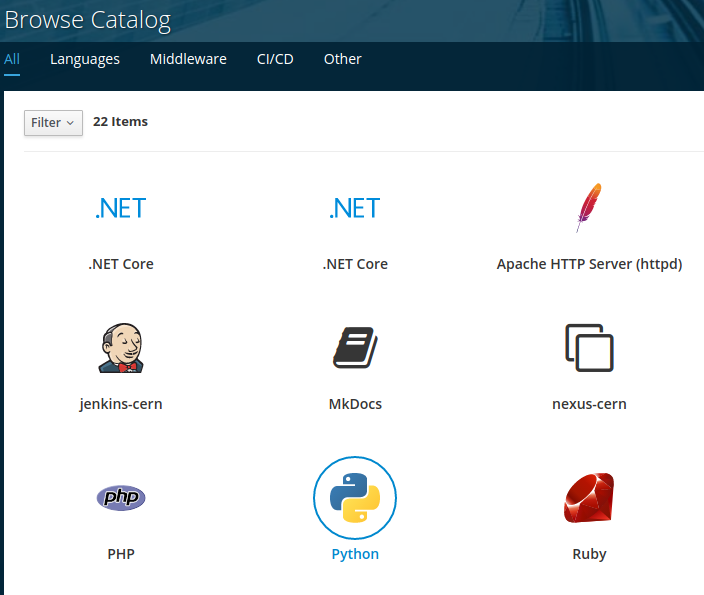
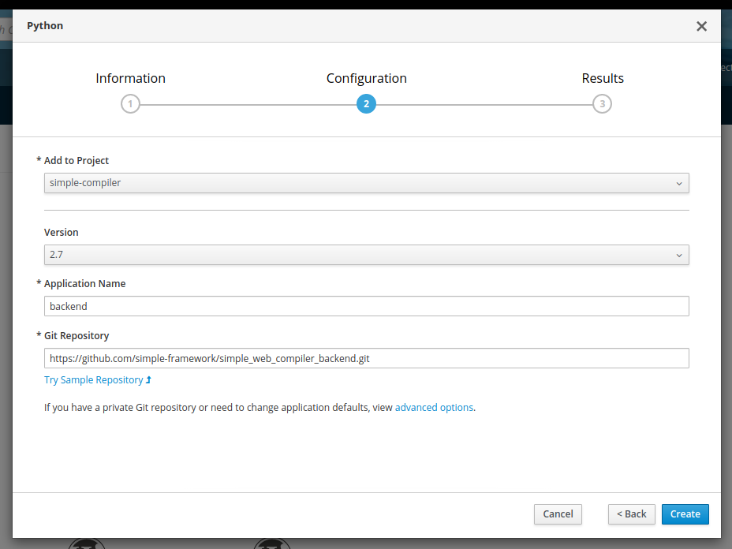

# SIMPLE YAML compiler Web UI (backend)
Backend for the SIMPLE YAML Compiler GUI web application.

Frontend repository can be found [here](https://github.com/simple-framework/simple_web_compiler_frontend).

### How to deploy to OpenShift
 1) Go to https://openshift.cern.ch/console/catalog
 
 2) Select Python from the list of options
 
 
 
 3) Select your project, set application name and select the repository. **Supported Python version is 2.7.** 
 
 
 
 4) (Optional) Add health-check to the backend deployment.

 
### Available endpoints
   * `/versions` - `GET` list of installed compiler versions
   * `/compile` - `POST` site-level config file to be compiled/augmented
       ```javascript
     // Request
     {
         "version": "v1.0.6",
         "site_conf": (binary)
     }
     
     // Response (success)
     {
         "augmented_conf": "...",
         "schema": "..."
     }
     
     // Response (failure)
     {
         "Input File": "<site-level conf>",
         "error": "<error traceback>",
         "file_name1": "...",
         "file_name2": "...",
         "file_name3": "...",
         ...
     }
     ```
   * `/health` - `GET` health check endpoint
   
### Installing new compiler versions

In order to install a new compiler simply download it from the SIMPLE Grid YAML compiler package page in PyPi [here](https://pypi.org/project/simple-grid-yaml-compiler/#history) and extract it inside the `compilers` directory.
The backend will take care of picking up the installed compilers and providing a list of available versions to the frontend.
